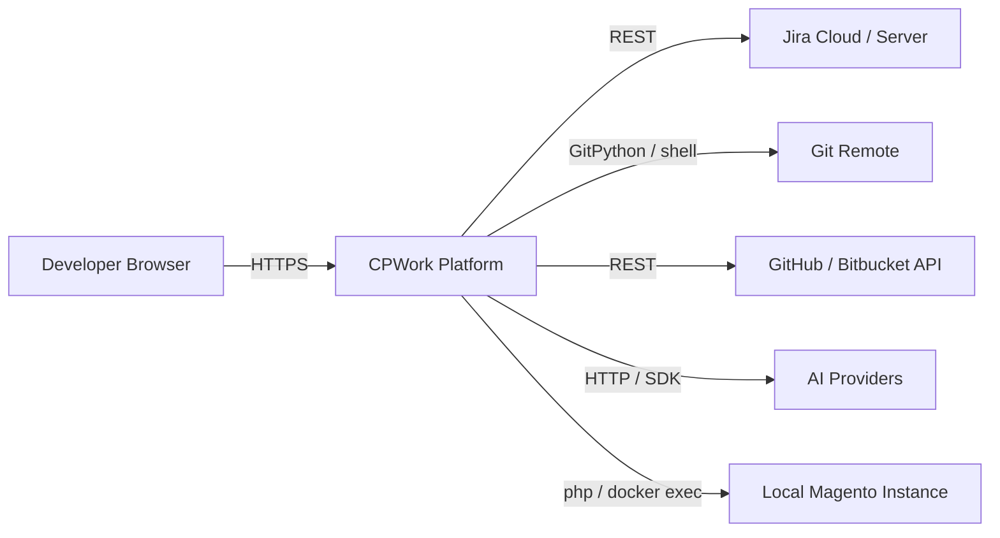
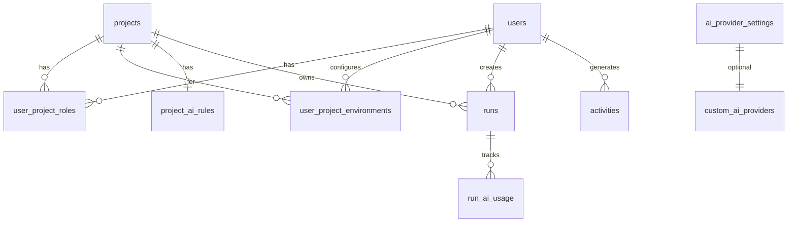
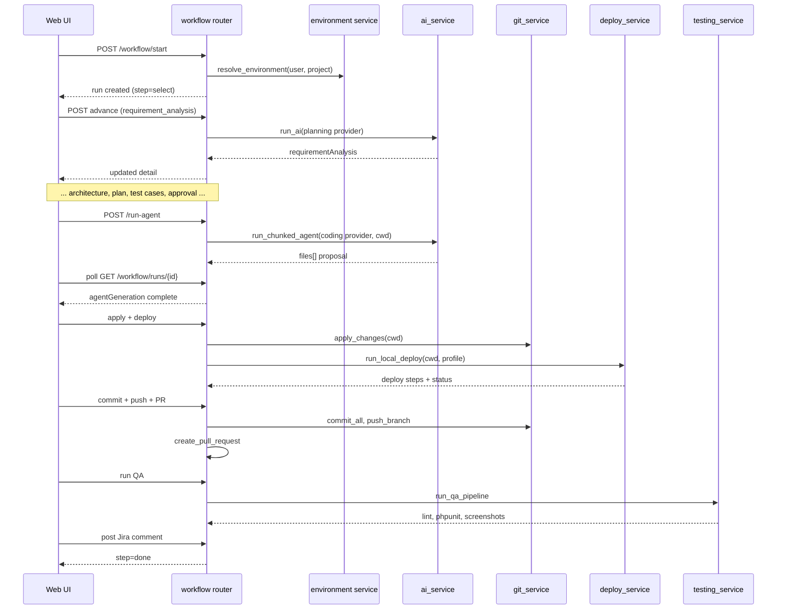

# CPWork — Architectural Documentation

| Field | Value |
|-------|-------|
| **System** | CPWork (Common Port for Agent) |
| **Repository** | `devpilotai` |
| **Document version** | 1.0 |
| **Last updated** | 2026-06-27 |
| **Audience** | Developers, reviewers, and operators |
| **Related** | [README](../README.md) · [Master Spec](./CPWORK-MASTER-SPEC-v1.md) |

---

## 1. Purpose

CPWork is a web-based orchestration platform for Magento 2 development teams. It unifies task intake (Jira), AI-assisted planning and coding, human review, local Magento builds, automated QA, and Git/PR workflows into a single guided pipeline.

### Design principles

1. **Human-in-the-loop** — AI proposes; developers review and explicitly apply changes. No silent auto-commit.
2. **Per-user local paths** — One logical project, many developer machines. Paths resolve at runtime per user.
3. **Staging PR only** — Commits push to feature branches; PRs target staging. Production is never auto-merged.
4. **Audit everything** — Login, workflow transitions, applies, deploys, and PRs are logged.
5. **Provider flexibility** — Planning and coding can use different LLM providers (e.g. OpenAI for analysis, Cursor SDK for code).

---

## 2. System context

CPWork sits between developers, external services, and local Magento installations.



### External dependencies

| System | Role | Integration |
|--------|------|-------------|
| **Jira** | Task source, comments | REST API; credentials encrypted per project |
| **Git remote** | Branch, push | GitPython + host `git` binary |
| **GitHub / Bitbucket** | Staging PR creation | REST API with stored tokens |
| **AI providers** | Planning, coding, review, auto-fix | Adapter pattern per provider |
| **Magento on disk** | Build, test, apply diffs | Resolved per-user `projectRoot`; optional Docker |
| **Playwright Chromium** | Visual smoke screenshots | Invoked during QA step |

---

## 3. Container architecture

The running system comprises three deployable containers of concern (logical, not Docker):

```mermaid
flowchart TB
    subgraph Browser
        WEB_UI[React SPA<br/>apps/web]
    end

    subgraph CPWork_Server
        API[FastAPI Backend<br/>apps/api_py]
        DB[(SQLite<br/>data/cpwork.db)]
        ARTIFACTS[Run Artifacts<br/>data/runs/]
    end

    subgraph Shared
        TYPES[@cpwork/shared<br/>TypeScript types]
    end

    WEB_UI -->|/api proxy dev| API
    WEB_UI -.->|build-time types| TYPES
    API --> DB
    API --> ARTIFACTS
    API -->|git / php / docker| HOST[Host filesystem<br/>Magento repos]
```

| Container | Technology | Port (dev) | Responsibility |
|-----------|------------|------------|----------------|
| **Web UI** | React 18, Vite 8, Tailwind, TanStack Query | 5173 | Dashboard, task board, execution center, admin |
| **API** | Python 3.10+, FastAPI, Uvicorn | 3000 | Auth, workflow, AI, deploy, git, jira |
| **Database** | SQLite (WAL mode) | — | Users, projects, runs, settings, audit |
| **Shared types** | TypeScript package | — | Contract between UI and API responses |

> **Note:** `apps/api` (Node.js + Express) exists as a legacy scaffold and is **not** the active backend. All production paths use `apps/api_py`.

---

## 4. Backend architecture

### 4.1 Layered structure

```
apps/api_py/
├── main.py              # FastAPI app, CORS, global exception handlers
├── config.py            # Environment variables
├── database.py          # SQLite connection, schema, migrations
├── routers/             # HTTP layer — thin, delegates to services
├── services/            # Business logic
├── db/                  # Repository pattern over SQLite
├── middleware/          # JWT auth dependency injection
└── lib/                 # Crypto, JWT, password hashing, errors
```

**Request flow:**

```
HTTP Request
  → middleware/auth.py (JWT from cookie or Bearer)
  → router (validation, access check)
  → service (business logic)
  → db/*_repo (persistence)
  → optional: subprocess / GitPython / httpx / Cursor SDK
```

### 4.2 Router map

| Router module | Prefix | Domain |
|---------------|--------|--------|
| `auth` | `/api/auth` | Login, logout, session, Jira identity |
| `admin_users` | `/api/admin/users` | User CRUD, project role assignment |
| `admin_projects` | `/api/admin/projects` | Project registry, Jira/Git/LLM defaults |
| `admin_activities` | `/api/admin/activities` | Audit log |
| `admin_ai_providers` | `/api/admin/ai-providers` | Provider keys, models, enable/disable |
| `admin_ai_rules` | `/api/admin/ai-rules` | Per-project prompt rules |
| `projects` | `/api/projects` | Project access, environments, LLM config |
| `jira` | `/api/projects/{id}/jira` | Task board, issue detail |
| `workflow` | `/api/workflow` | Step transitions, artifacts, async deploy/agent |
| `runs` | `/api/runs` | Apply, revert, commit, push, PR, tests |
| `ai` | `/api/ai` | Direct AI invocations |
| `agents` | `/api/agents` | Agent persona metadata |
| `chat` | `/api/chat` | In-run conversational context |
| `deployments` | `/api/deployments` | Deploy history |
| `dashboard` | `/api/dashboard` | Aggregated metrics |
| `reports` | `/api/reports` | Usage and productivity |
| `knowledge` | `/api/knowledge` | Knowledge base entries |
| `usage` | `/api/usage` | Token/credit tracking |

### 4.3 Core services

| Service | File | Responsibility |
|---------|------|----------------|
| **Workflow** | `services/workflow.py` | Step order, navigation rules, approval states |
| **Run detail** | `services/run_detail.py` | JSON document for per-run workflow state |
| **Environment** | `services/environment.py` | Merge project defaults + user overrides → `cwd` |
| **AI service** | `services/ai_service.py` | Prompt build, adapter dispatch, retry/validation loop |
| **Agent orchestrator** | `services/agents/orchestrator.py` | Route steps to planner/developer/reviewer/QA agents |
| **Prompt builder** | `services/prompt.py` | Mode-specific system prompts and output contracts |
| **Repo context** | `services/repo_context.py` | File excerpts, tree, changed paths for prompts |
| **Git service** | `services/git_service.py` | Branch, diff, apply, revert, commit, push |
| **PR service** | `services/pr_service.py` | GitHub/Bitbucket PR creation |
| **Deploy service** | `services/deploy_service.py` | Magento build pipeline (upgrade, compile, static) |
| **Deploy profile** | `services/deploy_profile.py` | light / standard / full from changed files |
| **Testing service** | `services/testing_service.py` | PHP lint, layout XML, PHPUnit, visual smoke |
| **Jira service** | `services/jira_service.py` | Board, issue detail, comments |
| **AI rules** | `services/ai_rules.py` | Merge project rules into prompts |
| **Docker DB** | `services/docker_db.py` | Docker exec for PHP/Magento in containers |

### 4.4 Async long-running tasks

Long operations run as `asyncio.Task` instances keyed by `run_id`:

| Task type | Module | Trigger |
|-----------|--------|---------|
| **Agent code generation** | `workflow.py` → `_agent_tasks` | `POST /workflow/runs/{id}/run-agent` |
| **Local deploy** | `workflow.py` → `_deploy_tasks` | Deploy step in workflow |

The frontend polls `GET /workflow/runs/{id}` until `agentGeneration.status` or deploy status completes. Timeouts: quick API calls 8s; long operations up to 600s.

---

## 5. Frontend architecture

### 5.1 Structure

```
apps/web/src/
├── App.tsx                 # Route table, auth gate
├── auth/AuthContext.tsx    # Session state, login/logout
├── lib/
│   ├── api.ts              # Axios client (credentials, timeouts)
│   ├── runAgentPipeline.ts # Poll agent until complete
│   ├── workflowAdvance.ts  # Step transition helpers
│   └── effectiveLlm.ts     # Resolve planning vs coding LLM
├── pages/                  # Route-level screens
├── components/
│   ├── execution-center/   # Task Execution Center step panels
│   ├── task-workflow/      # Workflow constants, step content
│   └── workspace/          # Task board, LLM config, custom tasks
└── hooks/                  # useDeployPipeline, useTestPipeline
```

### 5.2 Routing model

| Area | Routes | Key page |
|------|--------|----------|
| Dashboard | `/` | `DashboardPage` |
| Workspaces | `/workspaces/:projectId` | Jira task board |
| Execution | `/workspaces/:projectId/tasks/:taskKey` | `TaskExecutionCenterPage` |
| Tasks | `/tasks`, `/tasks/history`, `/tasks/custom` | Cross-project views |
| Admin | `/settings/users`, `projects`, `ai-providers`, `ai-rules` | Admin-only (RBAC) |
| Environments | `/settings/environments` | Per-user Magento paths |

Auth gate: unauthenticated users see only `/login`. Session loaded via `GET /api/auth/me` on mount.

### 5.3 State management

| Concern | Approach |
|---------|----------|
| **Server state** | TanStack Query (`useQuery` / `useMutation`) with cache keys per resource |
| **Auth session** | React Context (`AuthProvider`) |
| **Workflow busy UI** | `WorkflowBusyContext` — disables tabs during long operations |
| **Run workflow state** | Authoritative on server in `runs.detail_json`; UI refetches after mutations |

### 5.4 API communication

- Base URL: `/api` (Vite dev proxy → `localhost:3000`)
- Credentials: `withCredentials: true` (httpOnly JWT cookie)
- Error shape: `{ error, code?, details? }`

---

## 6. Data architecture

### 6.1 Entity relationship (logical)



### 6.2 Key tables

| Table | Purpose |
|-------|---------|
| `users` | Accounts, global role, Jira account ID, lockout state |
| `projects` | Shared config: defaults, Git, Jira, deploy profile, LLM JSON |
| `user_project_roles` | Per-project role assignment |
| `user_project_environments` | Per-user `project_root`, URLs, DB creds (encrypted) |
| `runs` | Workflow run header: status, step, Jira key, provider |
| `runs.detail_json` | Full workflow document (see §7) |
| `activities` | Immutable audit log |
| `ai_provider_settings` | Encrypted API keys, enabled flag, model overrides |
| `project_ai_rules` | Custom prompt rules per project |
| `run_ai_usage` | Token/latency per AI call |
| `custom_ai_providers` | Admin-defined OpenAI-compatible providers |

### 6.3 Run detail document

Workflow state is stored as JSON in `runs.detail_json`, merged with defaults in `run_detail.py`:

```json
{
  "currentStep": "agent",
  "completedSteps": ["select", "requirement_analysis", "..."],
  "jiraSnapshot": { "...": "..." },
  "requirementAnalysis": { "...": "..." },
  "architectureDesign": { "...": "..." },
  "planMarkdown": "...",
  "testCases": [],
  "output": { "files": [], "summary": "...", "manualTestChecklist": [] },
  "diffs": [],
  "applied": false,
  "deploy": { "status": "...", "steps": [] },
  "test": { "steps": [], "passRate": "..." },
  "git": { "branch": "...", "commits": [] },
  "approvalStatus": "pre_dev_approved",
  "agentGeneration": { "status": "running", "progress": [] }
}
```

File artifacts (screenshots, plan files) live under `data/runs/<run-id>/` and `data/task-plans/<project-slug>/`.

### 6.4 Migrations

Schema is applied idempotently on startup via `database.py`:
- `CREATE TABLE IF NOT EXISTS` for base schema
- `ALTER TABLE` checks for incremental columns (deploy profile, LLM config, Git PR fields, etc.)

---

## 7. Workflow state machine

### 7.1 Canonical steps

```
select → requirement_analysis → environment_setup → architecture_design
  → development_plan → test_cases → pre_dev_approval → agent
  → code_review → deploy → commit → qa → jira_comment → done
```

Legacy step IDs (`branch`, `describe`, `plan`, `review_plan`) are migrated server-side via `migrate_step()`.

### 7.2 Navigation rules

- **Forward:** Current step must be in `completedSteps` before jumping ahead (enforced by `can_navigate_to()`).
- **Backward:** Any prior step is always reachable.
- **Approvals:** `pre_dev_approval` gates code generation; `approvalStatus` tracks draft → pending → approved.

### 7.3 Agent persona mapping

| Agent ID | Steps handled |
|----------|---------------|
| `planner` | Analysis, architecture, plan, test cases, pre-dev approval |
| `developer` | Environment setup, code generation |
| `reviewer` | Code review, AI review |
| `qa` | QA / test execution |
| `deployment` | Deploy, commit, PR, Jira comment |

`devAgentId` on the run selects persona flavor: `magento`, `react`, `laravel`, `qa`.

### 7.4 Workflow sequence (happy path)



---

## 8. AI architecture

### 8.1 Provider adapter pattern

```
resolve_creds(provider_id)
  → get_adapter(provider_id)
  → adapter["chat"](creds, { system, user, model, jsonMode, cwd? })
  → normalize_agent_output(content)
  → validate (agent / deploy_fix / test_fix modes)
  → retry with validationErrors (up to MAX_AGENT_RETRIES)
```

| Provider ID | Adapter | Default use |
|-------------|---------|-------------|
| `openai` | OpenAI-compatible HTTP | Planning, analysis, review |
| `grok` | OpenAI-compatible (xAI) | General tasks |
| `cloud_ai` | Google Gemini | General tasks |
| `cursor` | Cursor SDK (`Agent.prompt`) | **Coding** — local `cwd` execution |
| `custom_*` | OpenAI-compatible (admin-defined) | Flexible |

### 8.2 Planning vs coding LLM

Per-project `llm_config_json` supports split configuration:

| Field | Purpose |
|-------|---------|
| `planningProvider` / `planningModel` | Analysis, architecture, plan, test cases, review |
| `codingProvider` / `codingModel` | Code generation step (`agent`) |
| `maxTokens`, `temperature`, `topP`, `jsonMode` | Generation parameters |

Resolved by `project_llm_config.py`; run-level overrides set during environment setup.

### 8.3 Prompt construction

`build_prompt(ctx)` assembles prompts from:

- **Mode** — `requirement_analysis`, `architecture_design`, `agent`, `deploy_fix`, `test_fix`, etc.
- **Jira snapshot** — summary, description, acceptance criteria
- **Repo context** — changed files, directory tree, excerpts
- **AI rules** — project-specific Magento/quality rules from `project_ai_rules`
- **Output contract** — JSON schema the model must return (files[], summary, checklist)
- **Validation errors** — fed back on retry attempts

### 8.4 Output validation

| Mode | Validator | On failure |
|------|-----------|------------|
| `agent` | `validate_agent_output` | Retry with `validationErrors`; merge refined files |
| `deploy_fix` | `validate_deploy_fix_output` | Retry; PHP lint check |
| `test_fix` | `validate_test_fix_output` | Retry |

Auto-fix loops also exist for deploy failures (`deploy_error_service`) and test failures (`test_error_service`) with domain-specific rules (layout XML, PHPUnit, PHP syntax).

---

## 9. Environment resolution

Every workflow operation that touches the filesystem calls `resolve_environment(user_id, project_id)`:

```
project = projects_repo.find(project_id)
env     = environments_repo.find(user_id, project_id)

cwd          = env.projectRoot          # must exist on disk
frontendUrl  = env.frontendUrl ?? project.defaults.frontendUrl
backendUrl   = env.backendUrl  ?? project.defaults.backendUrl
php_bin      = env.phpBin ?? "php"
docker       = env.dockerComposePath ?? project.defaults.dockerComposePath
```

If no environment is configured → HTTP 409 `needs_local_setup` with suggested defaults from the project.

Database connectivity can be resolved from Magento `app/etc/env.php` with Docker host remapping via `docker_db.py`.

---

## 10. Deploy pipeline

### 10.1 Profile resolution

| Profile | Trigger (auto mode) | Steps typically run |
|---------|---------------------|---------------------|
| `light` | Theme/layout/template/CSS/JS only | cache clean, maybe static deploy |
| `standard` | PHP, di.xml, module etc/*.xml | setup:upgrade, di:compile |
| `full` | composer.json, module.xml, registration.php | + composer install, static deploy |

Project setting `deploy_profile` can force `light`, `standard`, or `full` instead of `auto`.

### 10.2 Execution modes

| Mode | When |
|------|------|
| **Host PHP** | `php_bin` on host; commands run in `project_root` |
| **Docker exec** | `docker_compose_path` set; PHP/magento via `docker compose exec` |

Steps emit structured results: `{ key, label, ok, skipped, output }` stored in `detail.deploy`.

### 10.3 Failure recovery

On deploy failure:
1. `magento_error_parser` extracts error context
2. `deploy_error_service` builds fix excerpts and analysis
3. AI `deploy_fix` mode proposes minimal file changes
4. User can apply fix and re-run deploy

---

## 11. QA pipeline

Executed during the `qa` workflow step via `run_qa_pipeline()`:

| Check | Key | Condition |
|-------|-----|-----------|
| PHP lint | `php_lint` | Changed `.php` files |
| Layout XML validation | `layout_xml_validate` | Theme layout XML paths |
| PHPUnit | `phpunit` | Changed unit test files or module tests |
| Visual smoke | `visual_smoke` | Frontend URL configured + frontend changes |

Screenshots saved to `data/runs/<run-id>/screenshots/` via Playwright.

Test failures trigger `test_fix` AI mode with analogous retry/apply flow.

---

## 12. Security architecture

### 12.1 Authentication

```
POST /api/auth/login
  → bcrypt verify
  → JWT signed (sub, username, role)
  → Set httpOnly cookie (cpwork_token)
  → Account lockout after 5 failed attempts (15 min)
```

Subsequent requests: `get_auth` dependency reads cookie or `Authorization: Bearer`.

### 12.2 Authorization layers

| Layer | Check |
|-------|-------|
| **Global role** | `super_admin`, `admin` → full admin routes |
| **Project role** | `user_project_roles` → project-scoped routes |
| **Write access** | `owner`, `developer` → apply, commit, deploy |
| **Admin routes** | `require_admin` dependency |

### 12.3 Secret management

| Secret | Storage | Encryption |
|--------|---------|------------|
| Jira API token | `projects.jira_api_token_enc` | AES-256-GCM |
| Git API token | `projects.git_api_token_enc` | AES-256-GCM |
| AI provider keys | `ai_provider_settings.api_key_enc` | AES-256-GCM |
| DB password | `user_project_environments.database_password_enc` | AES-256-GCM |

Master key: `CPWORK_MASTER_KEY` (64 hex chars = 32 bytes). Rotation requires re-entering all stored secrets.

### 12.4 CORS

`WEB_ORIGIN` env var restricts API CORS to the frontend origin. Credentials allowed.

---

## 13. Observability & audit

### 13.1 Activity log

`activities` table records:

- User, action code, resource type/ID
- Project name, Jira key, human summary
- IP address, timestamp, optional metadata JSON

Written from routers on login, workflow transitions, applies, commits, PRs.

### 13.2 AI usage tracking

`run_ai_usage` stores per-call: provider, model, input/output tokens, latency. Surfaced in reports and dashboard productivity metrics.

### 13.3 Health endpoint

`GET /api/health` → `{ ok: true, service: "cpwork-api", env: "development" }`

Unhandled exceptions log stack traces server-side; clients receive generic 500.

---

## 14. Shared type contract

`packages/shared` is the TypeScript source of truth for API response shapes used by the frontend:

| Module | Exports |
|--------|---------|
| `roles.ts` | `GlobalRole`, `ProjectRole`, `isAdminRole()` |
| `types.ts` | `User`, `Project`, `RunDetail`, `TaskWorkflowStep`, `JiraBoard`, etc. |
| `deployProfile.ts` | Deploy profile modes |
| `activities.ts` | Activity action codes |

Built to `packages/shared/dist/` before web dev/build. Python backend mirrors shapes in Pydantic models and dict conventions.

---

## 15. Deployment topology (current)

### Development

```bash
./setup.sh          # venv + npm + seed
npm run dev         # API :3000 + Web :5173
```

### Production considerations (not yet containerized)

| Component | Recommendation |
|-----------|----------------|
| API | Uvicorn behind reverse proxy (nginx); `ENV=production` disables reload |
| Web | `npm run build` → static files served by nginx or CDN |
| Database | SQLite sufficient for single-host; PostgreSQL for multi-instance |
| Secrets | `JWT_SECRET`, `CPWORK_MASTER_KEY` via secure env injection |
| Magento access | API host must mount or reach developer Magento paths |

---

## 16. Known limitations & future direction

| Area | Current state | Planned |
|------|---------------|---------|
| Job queue | In-process `asyncio.Task` | Redis/BullMQ for multi-worker |
| Database | SQLite single-file | PostgreSQL for scale |
| Email | No self-service password reset | Phase 4 per master spec |
| Legacy API | `apps/api` Node backend | Deprecate or remove |
| Real-time | Polling for agent/deploy | WebSocket/SSE streaming |

---

## 17. Document map

| Document | Contents |
|----------|----------|
| [README.md](../README.md) | Quick start, scripts, troubleshooting |
| **This document** | Runtime architecture, data flow, security |
| [CPWORK-MASTER-SPEC-v1.md](./CPWORK-MASTER-SPEC-v1.md) | Full product spec, phased roadmap, API reference |

For implementation details of a specific subsystem, start with the service file listed in §4.3 and its corresponding router in §4.2.
