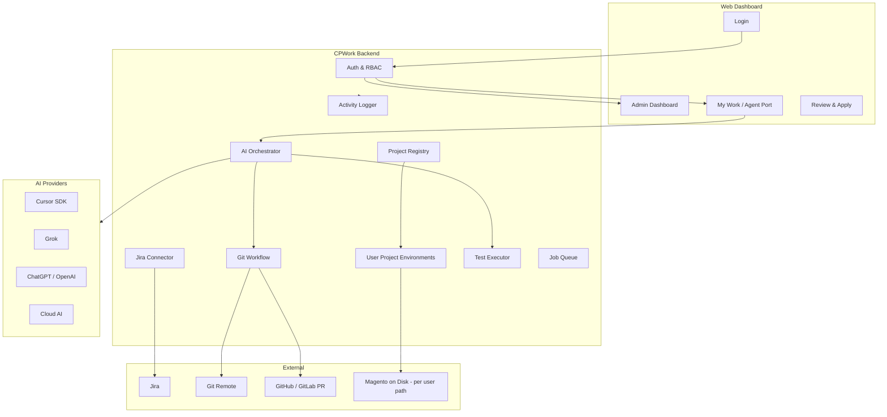
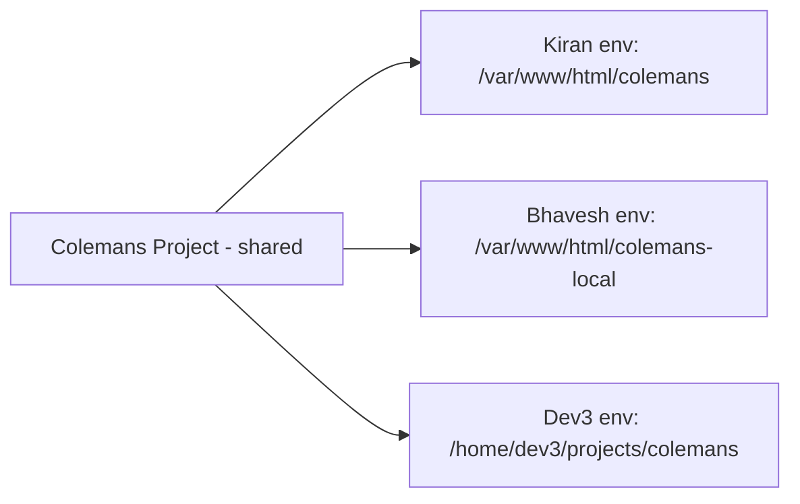
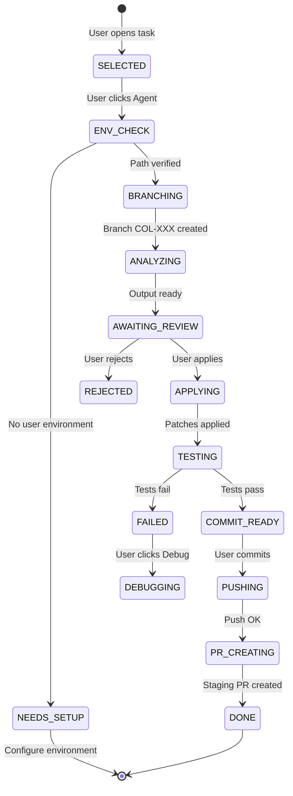

# CPWork — Master Specification v1

> **Common Port for Agent** — Magento development orchestration platform  
> Single-window automation: Jira → AI Agent → Review → Test → Commit → Staging PR

**Document version:** 1.0  
**Last updated:** 2026-06-19  
**Location:** `/var/www/html/cpwork`

---

## Table of Contents

1. [Overview](#1-overview)
2. [Goals & Principles](#2-goals--principles)
3. [Architecture](#3-architecture)
4. [Tech Stack](#4-tech-stack)
5. [Authentication & User Roles](#5-authentication--user-roles)
6. [Project Management](#6-project-management)
7. [Per-User Local Environment](#7-per-user-local-environment)
8. [Jira Integration](#8-jira-integration)
9. [Agent Port (Common Port)](#9-agent-port-common-port)
10. [Multi-AI Provider Layer](#10-multi-ai-provider-layer)
11. [Agent Workflow & State Machine](#11-agent-workflow--state-machine)
12. [Git & Pull Request Workflow](#12-git--pull-request-workflow)
13. [Magento Testing Pipeline](#13-magento-testing-pipeline)
14. [Easy-Mode UX Features](#14-easy-mode-ux-features)
15. [Activity Logging & Audit](#15-activity-logging--audit)
16. [Data Model](#16-data-model)
17. [API Reference](#17-api-reference)
18. [Security](#18-security)
19. [Phased Implementation Plan](#19-phased-implementation-plan)
20. [Repository Structure](#20-repository-structure)
21. [Open Decisions](#21-open-decisions)

---

## 1. Overview

**CPWork** is a web-based orchestration platform for Magento 2 development teams. It connects:

- **Jira** — task list, descriptions, attachments, status
- **AI agents** — Cursor SDK, Grok, ChatGPT, Cloud AI
- **Local Magento projects** — Hyva, Tailwind, Magewire, PHP 8.3
- **Git** — branch, commit, push, staging PR
- **Testing** — PHPUnit, DI compile, smoke URLs, screenshots

All from a **single window**, with human review before code is applied or shipped.

### Target users

| Role | Primary use |
|------|-------------|
| **Super Admin / Admin** | Users, projects, AI keys, activity audit |
| **Developer** | Jira tasks → Agent → review → test → PR |
| **Reviewer / Viewer** | Read-only or approve diffs |

### Environment assumptions

- PHP **8.3**
- MariaDB **10.6** (MySQL-compatible)
- Magento projects on disk (e.g. `/var/www/html/colemans`, `/var/www/html/colemans-local`)
- Multiple developers may use **different local paths** for the same logical project

---

## 2. Goals & Principles

1. **Human-in-the-loop** — Agent proposes; user reviews and applies. No silent auto-commit.
2. **Magento Admin is source of truth** — Business rules stay in Magento entities/config.
3. **Per-user local paths** — Same project, different folders per developer.
4. **Staging PR only** — Never auto-merge to production.
5. **Audit everything** — Login, runs, applies, commits, PRs logged.
6. **Simple mode for beginners, Pro mode for power users.**

---

## 3. Architecture



### Subsystems

| Subsystem | Responsibility |
|-----------|----------------|
| **Auth & RBAC** | Login, roles, sessions, password reset |
| **Project Registry** | Shared project config (Jira, Git, defaults) |
| **User Project Environments** | Per-user local path, URLs, DB overrides |
| **Jira Connector** | Tasks, descriptions, attachments, comments |
| **AI Orchestrator** | Route to provider, prompt build, output normalize |
| **Git Workflow** | Branch, diff, commit, push, staging PR |
| **Test Executor** | PHPUnit, DI compile, Playwright screenshots |
| **Activity Logger** | Audit trail for admin and support |
| **Job Queue** | Long-running agent runs with streaming |

---

## 4. Tech Stack

| Layer | Choice | Notes |
|-------|--------|-------|
| **Backend** | Node.js + Express (or Fastify) | Matches existing `ai-call-analyzer` patterns |
| **Frontend** | React + Tailwind | Single-page dashboard |
| **Database** | SQLite (Phase 0–1) → PostgreSQL (scale) | Projects, users, runs, activities |
| **Job queue** | BullMQ + Redis | Agent runs, tests |
| **AI — Cursor** | `@cursor/sdk` | Local `cwd` = user's resolved path |
| **AI — Grok** | xAI API | OpenAI-compatible streaming |
| **AI — ChatGPT** | OpenAI API | Plan, Debug, Ask; optional vision |
| **AI — Cloud AI** | Google Vertex / Gemini (default) | Configurable vendor |
| **Git / PR** | `simple-git` + `gh` CLI | Staging PR creation |
| **Jira** | REST API v3 | JQL, issues, attachments |
| **Screenshots** | Playwright | Frontend/admin smoke |
| **Secrets** | AES-256 encrypted fields + `CPWORK_MASTER_KEY` | API keys, DB passwords |

---

## 5. Authentication & User Roles

### 5.1 Entry flow

**First screen is always Login.** No access to projects or Agent Port without authentication.

```
/login          → Username + password
/reset-password → Self-service or admin-initiated reset
```

After login:

| Global role | Redirect |
|-------------|----------|
| `super_admin`, `admin` | `/admin` |
| `developer`, `viewer` | `/agent` (My Work) |

### 5.2 Global roles

| Role | Code | Permissions |
|------|------|-------------|
| Super Admin | `super_admin` | Full system access |
| Admin | `admin` | Users, projects, AI config, all activity |
| Developer | `developer` | Agent Port on **assigned projects only** |
| Viewer | `viewer` | Read-only tasks and runs |

### 5.3 Project-level roles

| Project role | Permissions |
|--------------|-------------|
| **Owner** | Full agent + optional project config (if enabled) |
| **Developer** | Agent, Plan, Debug, Ask, apply, test, commit, push, PR |
| **Reviewer** | View runs, approve/reject diffs — no commit |
| **Viewer** | View Jira and run history only |

Stored in `user_project_roles` (user + project + role).

### 5.4 Admin dashboard

After admin login:

1. **User list** — CRUD, assign project roles, reset password
2. **Projects list** — Create/edit shared project config
3. **Last 5 user activities** — Quick audit widget
4. **AI provider settings** — Grok, ChatGPT, Cloud AI, Cursor keys
5. **Link to full activity log** (Phase 4)

### 5.5 Password reset

| Flow | Phase |
|------|-------|
| Admin reset (temp password / force change) | Phase 0 |
| Email self-service reset | Phase 4 |

### 5.6 Bootstrap

On first deploy: **Setup Wizard** creates first `super_admin`. Wizard locks after first admin exists.

---

## 6. Project Management

### 6.1 Logical project (shared)

Admin manages **one logical project** per Magento codebase (e.g. Colemans). This is **not** tied to a single filesystem path.

**Shared fields:**

```json
{
  "id": "uuid",
  "name": "Colemans",
  "slug": "colemans-staging",
  "enabled": true,
  "description": "Colemans Magento Hyva storefront",

  "defaults": {
    "projectRoot": "/var/www/html/colemans",
    "frontendUrl": "https://colemans.local",
    "backendUrl": "https://colemans.local/admin",
    "dockerComposePath": null,
    "dockerPatchId": null
  },

  "database": {
    "host": "127.0.0.1",
    "port": 3306,
    "name": "colemans",
    "user": "magento"
  },

  "magento": {
    "phpBin": "php",
    "magentoBin": "bin/magento",
    "composerBin": "composer",
    "unitTestSuite": "unit"
  },

  "git": {
    "remote": "origin",
    "productionBranch": "production",
    "stagingBranch": "staging",
    "prTargetBranch": "staging",
    "commitMessageTemplate": "[{jiraKey}] {summary}"
  },

  "jira": {
    "baseUrl": "https://company.atlassian.net",
    "projectKey": "COL",
    "email": "dev@company.com",
    "statusFilters": ["To Do", "In Progress", "Unit Testing"],
    "assigneeFilter": "currentUser()"
  },

  "agent": {
    "defaultProvider": "cursor",
    "defaultModel": "composer-2.5",
    "modeProviders": {
      "agent": "cursor",
      "plan": "openai",
      "debug": "grok",
      "ask": "cloud_ai"
    },
    "fallbackChain": ["cursor", "openai", "grok"],
    "rulesFile": ".cursor/rules/magento-hyva.mdc",
    "maxRunMinutes": 45
  }
}
```

> **Important:** `defaults.projectRoot` and URLs are **templates** for new user setup — not the path used for all users.

### 6.2 Admin project UI

- List all projects with assigned user count, last run, health
- Tabbed edit: General | Paths (defaults) | URLs | Database | Git | Jira | Agent | Access
- **Connection test buttons:** Jira, Git, DB (using admin's or template path)

### 6.3 Developer project access

Developers see **only projects** where they have a `user_project_role` **and** a configured `user_project_environment` (or are prompted to configure on first open).

---

## 7. Per-User Local Environment

### 7.1 Problem

Multiple users work on the same logical project (e.g. Colemans) but each has a **different local path**:

| User | Local `project_root` |
|------|----------------------|
| Kiran | `/var/www/html/colemans` |
| Bhavesh | `/var/www/html/colemans-local` |
| Dev3 | `/home/dev3/projects/colemans` |

Shared: Jira key, Git remote, branch naming.  
Different: filesystem path, often local URLs and database names.

### 7.2 Solution: two layers

| Layer | Table | Managed by | Purpose |
|-------|-------|------------|---------|
| **Logical project** | `projects` | Admin | Jira, Git remote, branches, defaults |
| **User environment** | `user_project_environments` | Each developer | Path, local URLs, local DB |



### 7.3 Schema: `user_project_environments`

```sql
user_project_environments (
  id                UUID PRIMARY KEY,
  user_id           UUID NOT NULL REFERENCES users(id),
  project_id        UUID NOT NULL REFERENCES projects(id),

  project_root      TEXT NOT NULL,          -- e.g. /var/www/html/colemans-local
  frontend_url      TEXT,
  backend_url       TEXT,

  database_host     TEXT,
  database_port     INTEGER DEFAULT 3306,
  database_name     TEXT,
  database_user     TEXT,
  database_password_encrypted TEXT,

  docker_compose_path TEXT,
  docker_patch_id   TEXT,
  php_bin           TEXT,

  path_verified_at  TIMESTAMP,
  last_health_json  JSON,

  created_at        TIMESTAMP DEFAULT NOW(),
  updated_at        TIMESTAMP DEFAULT NOW(),

  UNIQUE(user_id, project_id)
);
```

### 7.4 Path resolution (mandatory before any run)

```typescript
async function resolveProjectEnvironment(
  userId: string,
  projectId: string
): Promise<ResolvedEnvironment> {
  const project = await projects.findById(projectId);
  const userEnv = await userProjectEnvironments.find(userId, projectId);

  if (!userEnv?.project_root) {
    throw new NeedsLocalSetupError({
      projectId,
      message: 'Configure your local environment for this project',
      suggestedDefaults: project.defaults,
    });
  }

  if (!fs.existsSync(userEnv.project_root)) {
    throw new PathNotFoundError({
      path: userEnv.project_root,
      message: 'Project path does not exist on this machine',
    });
  }

  return {
    project,
    userEnv,
    cwd: userEnv.project_root,
    frontendUrl: userEnv.frontend_url ?? project.defaults.frontendUrl,
    backendUrl: userEnv.backend_url ?? project.defaults.backendUrl,
    database: mergeDatabase(project.database, userEnv),
  };
}
```

**Security:** Client never sends `project_root` in run requests. Backend resolves from **session user ID** only (prevents path injection).

### 7.5 First-time developer setup UI

When a developer opens an assigned project without an environment:

```
┌─────────────────────────────────────────────────────────┐
│ Configure your local environment — Colemans              │
├─────────────────────────────────────────────────────────┤
│ Project path *     [/var/www/html/colemans-local     ]  │
│ Frontend URL       [https://colemans-local.test       ]  │
│ Admin URL          [https://colemans-local.test/admin ]  │
│ Database name      [colemans_local                    ]  │
│                                                         │
│ [Test Connection]   [Save & Continue]                     │
└─────────────────────────────────────────────────────────┘
```

Pre-fill from `projects.defaults` where available.

### 7.6 Connection test (`POST .../my-environment/test`)

| Check | Pass criteria |
|-------|---------------|
| Path exists | Directory readable |
| Magento detected | `bin/magento` exists |
| Git repo | `.git` present |
| Git remote | Matches project config (warn if mismatch) |
| Database | TCP connect + credentials (optional) |
| Frontend URL | HTTP 200/302 (optional) |

Store result in `path_verified_at` and `last_health_json`.

### 7.7 My Environments (developer settings)

| Project | My path | Status | Actions |
|---------|---------|--------|---------|
| Colemans | `/var/www/html/colemans-local` | ✓ Verified 2h ago | Edit |
| BigCity | `/var/www/html/bigcity248` | ✗ Path missing | Fix |

### 7.8 Admin support view (read-only paths)

| User | Project | Role | Local path | Last verified |
|------|---------|------|------------|---------------|
| Kiran | Colemans | developer | `/var/www/html/colemans` | ✓ |
| Bhavesh | Colemans | developer | `/var/www/html/colemans-local` | ✓ |

Admin does **not** need to maintain per-user paths; developers own their environments.

### 7.9 Agent, Git, and tests use resolved path

| Operation | Path source |
|-----------|-------------|
| Cursor SDK `local.cwd` | `userEnv.project_root` |
| Git branch / commit | `userEnv.project_root` |
| PHPUnit | `userEnv.project_root` |
| `bin/magento` | `userEnv.project_root` |
| Playwright screenshots | `userEnv.frontend_url` / `backend_url` |
| Push to remote | Same `git.remote` from project — user's local clone |

### 7.10 Concurrent work on same Jira task

Optional **task lock** (recommended Phase 2):

- When user starts Agent on `COL-123`, lock task to that user
- Other users see: "COL-123 in progress by Bhavesh"
- Lock released on run complete, fail, or manual unlock

### 7.11 What stays shared vs per-user

| Setting | Shared (`projects`) | Per-user (`user_project_environments`) |
|---------|----------------------|----------------------------------------|
| Jira project key | ✓ | — |
| Git remote name/URL | ✓ | — |
| Production/staging branch names | ✓ | — |
| PR target branch | ✓ | — |
| **Local project path** | default template only | ✓ **required** |
| Frontend URL | default | ✓ override |
| Admin URL | default | ✓ override |
| Database connection | default | ✓ override |
| Docker compose path | default | ✓ override |
| AI provider defaults | ✓ | optional user preference |

---

## 8. Jira Integration

### 8.1 Task board (Agent Port sidebar)

Statuses (configurable per project): **To Do**, **In Progress**, **Unit Testing**

JQL example:

```sql
project = COL
AND status IN ("To Do", "In Progress", "Unit Testing")
AND assignee = currentUser()
ORDER BY updated DESC
```

### 8.2 Per-task data

- Key, summary, status, assignee, priority
- Description (auto-filled in workspace)
- Attachments (download to run artifacts; images inline in Phase 4)
- Acceptance criteria / comments (optional)

### 8.3 Post-completion (Phase 3)

- Comment on Jira with PR link and test summary
- Optional status transition (e.g. → Unit Testing / Code Review)

### 8.4 Caching

- Refresh task list every 2–5 minutes
- Webhook instant update (Phase 4)

---

## 9. Agent Port (Common Port)

### 9.1 Layout

```
┌──────────────────────────────────────────────────────────────────┐
│ [Project ▼ Colemans]  [Simple | Pro]  [kiran ▼] [Logout]       │
├──────────────┬───────────────────────────────────────────────────┤
│ JIRA TASKS   │  AGENT WORKSPACE                                   │
│              │                                                    │
│ COL-123      │  Task: COL-123 — Fix checkout pass validation      │
│ To Do    [▶] │  ┌ Jira Description (read-only, auto-filled) ───┐ │
│              │  └──────────────────────────────────────────────┘ │
│ COL-124      │  ┌ Your Instructions (editable) ────────────────┐ │
│ In Prog  [▶] │  └──────────────────────────────────────────────┘ │
│              │  [+ Bug fix] [+ Hyva block] [+ PHPUnit]  snippets   │
│              │  AI: [Recommended ▼]  Model: [auto ▼]  (Pro mode) │
│              │  [Agent] [Plan] [Debug] [Ask] [Reset]              │
│              │  ── Output / Diff Review ─────────────────────────  │
│              │  [Apply All] [Apply Selected] [Reject] [Revise]    │
│              │  ── Tests ────────────────────────────────────────  │
│              │  [Apply & Test]  [Ship to Staging]                   │
└──────────────┴───────────────────────────────────────────────────┘
```

### 9.2 Task row actions

| Control | Behavior |
|---------|----------|
| **[▶] / [Start]** | Open workspace, fetch Jira, resolve user env, optional Quick Start |
| **Status badge** | Live Jira status |

### 9.3 Mode buttons

| Mode | Behavior |
|------|----------|
| **Agent** | Branch → analyze → propose changes → review → apply → test → commit → push → PR |
| **Plan** | Analysis and implementation plan only — no file writes |
| **Debug** | Error-focused investigation with logs and test output |
| **Ask** | Q&A — no branch, no file changes |
| **Reset** | Clear workspace; optional undo unapplied changes |

### 9.4 Prompt assembly

Includes: Magento/Hyva rules, resolved `cwd`, Jira description, attachments summary, user instructions, mode-specific constraints.

---

## 10. Multi-AI Provider Layer

### 10.1 Providers

| ID | Name | API | Best for |
|----|------|-----|----------|
| `cursor` | Cursor SDK | Local/cloud agent | Full Agent mode — real file edits |
| `grok` | Grok (xAI) | xAI REST | Fast plan/debug |
| `openai` | ChatGPT | OpenAI REST | Detailed plans, vision (screenshots) |
| `cloud_ai` | Cloud AI | Vertex/Gemini (default) | Long context, multimodal |

### 10.2 Hybrid model (recommended)

| Mode | Default provider | Reason |
|------|------------------|--------|
| Agent | Cursor (local) | Executes on user's `project_root` |
| Plan | OpenAI or Cloud AI | Strong planning |
| Debug | Grok or OpenAI | Iteration on errors |
| Ask | Any | User preference |

API providers (Grok, OpenAI, Cloud AI) return **structured patches** → Review Panel → Patch Applier → Test Executor.

### 10.3 Provider adapter interface

```typescript
interface AiProviderAdapter {
  id: 'cursor' | 'grok' | 'openai' | 'cloud_ai';
  streamRun(input: RunInput): AsyncIterable<StreamEvent>;
  normalizeOutput(raw: unknown): NormalizedAgentOutput;
  supportsVision: boolean;
  supportsLocalFileTools: boolean;
}
```

### 10.4 Structured output (API providers)

```json
{
  "summary": "Fix checkout pass validation for COL-123",
  "files": [
    {
      "path": "app/code/Vendor/Module/Model/Validator.php",
      "action": "modify",
      "reason": "Add pass date validation",
      "patch": "--- a/...\n+++ b/...\n@@ ..."
    }
  ],
  "tests": [],
  "manualTestChecklist": ["Add expired pass to cart"],
  "risks": ["May affect coupon flow"]
}
```

### 10.5 Admin AI settings

- Enable/disable each provider
- Encrypted API keys / GCP credentials
- Default models per provider
- Per-project overrides and fallback chain
- **Test connection** button per provider

### 10.6 Simple vs Pro mode

| Mode | AI UI |
|------|-------|
| **Simple** | "AI: Recommended" — hides provider/model |
| **Pro** | Full provider + model dropdown, fallback toggle, cost estimate |

---

## 11. Agent Workflow & State Machine



### 11.1 Happy path steps

1. Resolve **user** environment (path, URLs)
2. Create branch from `production`: e.g. `COL-123`
3. Run AI provider with assembled prompt
4. Normalize output → file list + diffs
5. **User reviews** — side-by-side diff, partial apply
6. Apply selected changes to user's local repo
7. Run Magento test pipeline
8. Capture screenshots
9. On failure — block commit, prominent errors, offer Debug
10. Commit with editable message: `[COL-123] Summary`
11. Push to `origin/COL-123`
12. Create PR → **staging** only
13. Jira comment + optional status update

### 11.2 Three-click happy path (Simple mode)

1. **[Start]** on Jira task  
2. **[Apply & Test]** after review  
3. **[Ship to Staging]** — commit + push + PR  

---

## 12. Git & Pull Request Workflow

### 12.1 Hard rules

| Rule | Value |
|------|-------|
| Branch from | `production` (or project config) |
| Branch name | Jira key exactly: `COL-123` |
| PR target | `staging` only |
| Force push | Blocked on production/staging |
| Secrets in commit | Blocked (.env, credentials) |

### 12.2 PR body (auto-generated)

```markdown
## Jira
[COL-123](https://jira.../COL-123)

## Summary
{agent summary}

## Files Changed
- app/code/Vendor/Module/...

## Test Results
- PHPUnit: 12 passed
- Screenshots: run #{runId}

## Manual Test Checklist
- [ ] ...
```

### 12.3 Multi-user Git note

Each developer pushes from **their** local clone at **their** `project_root` to the **same remote**. Coordinate with task locks to avoid branch conflicts.

---

## 13. Magento Testing Pipeline

| Tier | Check | Block commit? |
|------|-------|---------------|
| T1 | `php -l` on changed PHP files | Yes |
| T2 | PHPUnit on affected modules | Yes |
| T3 | `bin/magento setup:di:compile` (if DI XML changed) | Yes |
| T4 | PHPCS (optional) | Configurable |
| T5 | Playwright smoke — frontend + admin | Warn |
| T6 | Screenshots — before/after | Attach to run |

**Commands run in:** `userEnv.project_root`

---

## 14. Easy-Mode UX Features

### 14.1 Priority features

| Priority | Feature |
|----------|---------|
| P0 | Setup wizard + connection tests |
| P0 | **My Work** dashboard as developer home |
| P0 | One-click **Start** per Jira task |
| P0 | **Apply & Test** + **Ship to Staging** buttons |
| P0 | Per-user local environment setup |
| P1 | Prompt snippets (Bug fix, Hyva block, Plugin, PHPUnit) |
| P1 | Side-by-side diff + partial apply |
| P1 | Simple / Pro UI toggle |
| P1 | In-app + Slack notifications |
| P2 | Resume run on same Jira task |
| P2 | Task timeline per Jira key |
| P2 | Task lock (one dev per ticket) |
| P2 | Rollback / undo apply |
| P3 | Compare AI providers side-by-side |
| P3 | Full analytics dashboard |

### 14.2 Developer home (My Work)

```
My Work (6 tasks)
├── COL-123  In Progress   [Resume]
├── COL-124  To Do         [Start]
└── BC-88    Unit Testing  [View PR]

⚠ Colemans: configure local path  [Setup]
```

### 14.3 Health panel (per project, per user)

```
Ready to work on Colemans?
✓ Local path: /var/www/html/colemans-local
✓ Git remote OK
✓ bin/magento found
✓ Jira connected
✗ PHPUnit: vendor/bin/phpunit missing — [Guide]
```

---

## 15. Activity Logging & Audit

### 15.1 Logged events

| Action | Example |
|--------|---------|
| `auth.login` | User logged in |
| `auth.login_failed` | Failed attempt |
| `user.created` | Admin created user |
| `user.environment_updated` | Bhavesh set colemans-local path |
| `project.updated` | Admin edited Colemans |
| `run.started` | Agent run COL-123 |
| `run.applied` | User applied diff |
| `run.committed` | Commit created |
| `run.pr_created` | Staging PR opened |
| `run.failed` | Tests failed |

### 15.2 Admin widget

**Last 5 user activities** on dashboard; full log page in Phase 4.

---

## 16. Data Model

### 16.1 Core tables

```
users
user_project_roles
user_project_environments    ← per-user local path (Section 7)
projects
password_reset_tokens
sessions
activities
runs
run_artifacts
run_ai_usage
ai_provider_settings
project_ai_settings
```

### 16.2 Key relationships

```
users ──┬── user_project_roles ─── projects
        └── user_project_environments ─── projects

projects ─── runs ─── run_artifacts
         └── run_ai_usage
```

---

## 17. API Reference

### 17.1 Auth

| Method | Endpoint | Access |
|--------|----------|--------|
| POST | `/api/auth/login` | Public |
| POST | `/api/auth/logout` | User |
| GET | `/api/auth/me` | User |
| POST | `/api/auth/reset-password/request` | Public |
| POST | `/api/auth/reset-password/confirm` | Public |

### 17.2 Admin

| Method | Endpoint | Access |
|--------|----------|--------|
| GET | `/api/admin/users` | Admin |
| POST | `/api/admin/users` | Admin |
| PUT | `/api/admin/users/:id` | Admin |
| PUT | `/api/admin/users/:id/project-roles` | Admin |
| POST | `/api/admin/users/:id/reset-password` | Admin |
| GET | `/api/admin/projects` | Admin |
| PUT | `/api/admin/projects/:id` | Admin |
| GET | `/api/admin/projects/:id/environments` | Admin |
| GET | `/api/admin/activities?limit=5` | Admin |
| GET/PUT | `/api/admin/ai-providers` | Admin |
| POST | `/api/admin/ai-providers/:id/test` | Admin |

### 17.3 Projects & per-user environment

| Method | Endpoint | Access |
|--------|----------|--------|
| GET | `/api/projects` | User (assigned only) |
| GET | `/api/projects/:id` | User (assigned) |
| GET | `/api/projects/:id/my-environment` | User |
| PUT | `/api/projects/:id/my-environment` | User |
| POST | `/api/projects/:id/my-environment/test` | User |
| GET | `/api/projects/:id/jira/tasks` | User |
| GET | `/api/projects/:id/health` | User (uses resolved env) |

### 17.4 Jira & runs

| Method | Endpoint | Access |
|--------|----------|--------|
| GET | `/api/jira/issues/:key` | User |
| POST | `/api/runs` | User |
| GET | `/api/runs/:id` | User |
| GET | `/api/runs/:id/stream` | User (SSE) |
| POST | `/api/runs/:id/apply` | User |
| POST | `/api/runs/:id/test` | User |
| POST | `/api/runs/:id/commit` | User |
| POST | `/api/runs/:id/push` | User |
| POST | `/api/runs/:id/pr` | User |
| POST | `/api/runs/:id/reset` | User |
| POST | `/api/runs/:id/ship` | User (commit+push+pr bundle) |

**Run request body** (client does NOT send path):

```json
{
  "projectId": "uuid",
  "jiraKey": "COL-123",
  "mode": "agent",
  "provider": "cursor",
  "model": "composer-2.5",
  "userInstructions": "Also cover guest checkout"
}
```

Backend resolves `cwd` from `user_project_environments` for session user.

---

## 18. Security

| Concern | Mitigation |
|---------|------------|
| Passwords | bcrypt/argon2 hash |
| API keys | Encrypted at rest; never sent to frontend |
| Sessions | httpOnly JWT or server session; CSRF on mutations |
| Path injection | Never accept path from client; resolve server-side |
| Agent sandbox | Restrict file ops to resolved `project_root` |
| Login brute force | Rate limit + lock after 5 failures |
| Secrets in commits | Pre-commit scanner |
| Audit | All admin and run actions logged |
| Disable user | Invalidate active sessions immediately |

---

## 19. Phased Implementation Plan

### Phase 0 — Auth & Admin (1–2 weeks)

- [ ] Users, roles, sessions, login, logout
- [ ] Setup wizard → first super_admin
- [ ] Admin dashboard: users, projects, last 5 activities
- [ ] User project role assignment
- [ ] Admin password reset
- [ ] Activity logger

**Exit:** Admin logs in, creates users, assigns Colemans roles.

---

### Phase 0.5 — Per-User Environments + AI Providers (1–2 weeks)

- [ ] `user_project_environments` table and APIs
- [ ] Configure local environment UI + connection test
- [ ] Path resolution middleware (block runs without env)
- [ ] Admin environments read-only view
- [ ] AI provider settings (admin)
- [ ] Provider adapters: OpenAI, Grok, Cloud AI, Cursor
- [ ] Provider router + output normalizer

**Exit:** Kiran and Bhavesh both work on Colemans with different paths; Plan mode works on each.

---

### Phase 1 — Jira + Agent Port Shell (2–3 weeks)

- [ ] Project CRUD with shared config
- [ ] Jira task list (Todo, In Progress, Unit Testing)
- [ ] Agent workspace UI (descriptions, instructions, modes)
- [ ] My Work dashboard
- [ ] Plan + Ask modes with streaming
- [ ] Health panel per user/project
- [ ] Prompt snippets

**Exit:** Select project → see Jira tasks → run Plan with chosen AI.

---

### Phase 2 — Git + Review/Apply (2–3 weeks)

- [ ] Branch from production (Jira key as name)
- [ ] Agent mode with Cursor + patch-based providers
- [ ] Diff review panel (side-by-side, partial apply)
- [ ] Apply / Reject / Revise
- [ ] Task lock (optional)
- [ ] BullMQ job queue for long runs
- [ ] Resume run

**Exit:** Full propose → review → apply on user's local branch.

---

### Phase 3 — Test + Ship (2 weeks)

- [ ] PHPUnit + DI compile pipeline
- [ ] Playwright screenshots
- [ ] Apply & Test + Ship to Staging buttons
- [ ] Commit (editable message) + push + staging PR
- [ ] Jira comment with PR link
- [ ] Slack / in-app notifications

**Exit:** End-to-end COL-123 → PR on staging.

---

### Phase 4 — Polish & Scale (ongoing)

- [ ] Email password reset
- [ ] Jira webhooks
- [ ] Full activity log + export
- [ ] Analytics (time to PR, AI cost)
- [ ] Compare AI providers
- [ ] Magento module wizard templates
- [ ] Multi-server deployment (PostgreSQL, Redis)

---

## 20. Repository Structure

```
cpwork/
├── apps/
│   ├── api/
│   │   ├── src/
│   │   │   ├── modules/
│   │   │   │   ├── auth/
│   │   │   │   ├── users/
│   │   │   │   ├── projects/
│   │   │   │   ├── environments/    # per-user local paths
│   │   │   │   ├── jira/
│   │   │   │   ├── agent/
│   │   │   │   ├── providers/       # cursor, grok, openai, cloud_ai
│   │   │   │   ├── git/
│   │   │   │   ├── testing/
│   │   │   │   ├── runs/
│   │   │   │   └── activities/
│   │   │   ├── middleware/
│   │   │   │   ├── auth.ts
│   │   │   │   └── resolveEnvironment.ts
│   │   │   └── workers/
│   │   └── package.json
│   └── web/
│       ├── src/
│       │   ├── pages/
│       │   │   ├── Login/
│       │   │   ├── Admin/
│       │   │   ├── MyWork/
│       │   │   ├── AgentPort/
│       │   │   ├── MyEnvironments/
│       │   │   └── RunHistory/
│       │   └── components/
│       └── package.json
├── packages/
│   └── shared/                      # types, schemas
├── data/
│   ├── cpwork.db
│   └── runs/                        # artifacts, screenshots
├── docs/
│   └── CPWORK-MASTER-SPEC-v1.md     # this document
├── docker-compose.yml               # Redis (Phase 2+)
└── README.md
```

---

## 21. Open Decisions

Confirm before Phase 0.5 implementation:

| # | Question | Options |
|---|----------|---------|
| 1 | Cloud AI vendor | Google Vertex/Gemini (default), Azure OpenAI, Cursor Cloud |
| 2 | Git host | GitHub, GitLab, Bitbucket |
| 3 | Jira | Cloud vs Server/Data Center |
| 4 | Agent on API providers | Patch-apply allowed, or Cursor-only for Agent mode? |
| 5 | Admin edit user paths | Read-only (recommended) vs admin override |
| 6 | Task lock | Required vs optional |
| 7 | Email SMTP | Phase 4 or external reset only |

---

## Appendix A — Example: Colemans with two developers

**Admin creates project:**

- Name: Colemans  
- Jira: COL  
- Git: production → staging  
- Default path template: `/var/www/html/colemans`  

**Admin assigns:**

- Kiran → developer  
- Bhavesh → developer  

**Kiran configures environment:**

- Path: `/var/www/html/colemans`  
- URL: `https://colemans.local`  

**Bhavesh configures environment:**

- Path: `/var/www/html/colemans-local`  
- URL: `https://colemans-local.test`  

**Both run COL-123:**

- Same Jira task, same branch name, same remote PR target  
- Different local `cwd` for agent and tests  
- Each pushes from their own clone when ready  

---

## Appendix B — Route map

| Route | Access | Screen |
|-------|--------|--------|
| `/login` | Public | Login |
| `/reset-password` | Public | Password reset |
| `/admin` | Admin | Dashboard |
| `/admin/users` | Admin | User management |
| `/admin/projects` | Admin | Project management |
| `/admin/ai-providers` | Admin | AI configuration |
| `/agent` | Developer+ | My Work |
| `/agent/:projectSlug/:jiraKey` | Developer+ | Agent workspace |
| `/my-environments` | Developer+ | Per-user path config |
| `/runs` | Developer+ | Run history |

---

*End of CPWork Master Specification v1*
